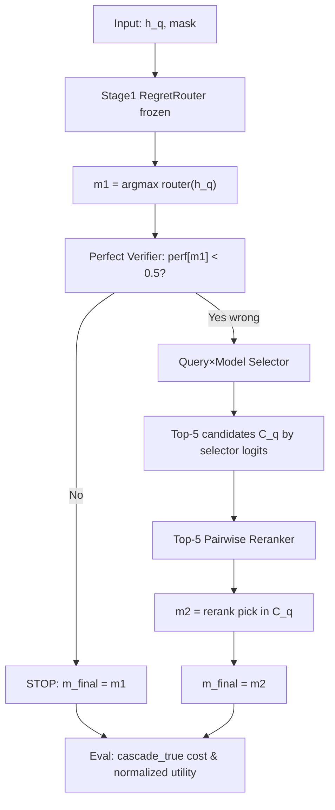

# RegretRouter 两阶段复现指南

> 基于源码：`regretrouter.py`、`pool_data.py`、`rdf_router.py`、`reward_builder.py`、`rdf_query_model_selector.py`、`rdf_vg_cascade.py`、`rdf_cascade_decomp.py`；主表入口 `scripts/run_multiseed_main_tables.py`。

---

## 1. 概述

### RegretRouter（Stage 1，one-shot）

**RegretRouter** 是 K=3 步显式 unrolling 的递归决策聚焦路由器（`RecursiveDFLRouter` v1）：

- 输入 query embedding $h_q$，输出软分布 $x_K$，硬路由 $m = \arg\max_m x_{K,m}$
- 训练目标：**final-step regret**（非逐步 regret）
- 初始化：在可用模型上 **uniform** $x_0$
- 训练 utility：$U_m = \mathrm{perf}_m - \lambda \cdot c_{\mathrm{norm},m}$（per-query min-max，ignore zero cost）
- 推理：单次选模，无二次调用

代码常量：`OURS_METHOD_NAME = "RegretRouter"`（`regretrouter.py`）

### RegretRouter + Cascade（Stage 1 + Stage 2，完整 Ours）

在 **frozen RegretRouter** 选出 $m_1$ 后：

1. **Perfect Verifier（Level B）**：若 $\mathrm{perf}_{m_1} < 0.5$ 则进入 recourse
2. **Query×Model Selector**：在 wrong 子集上为每个 $(q,m)$ 打分，softmax 得 $m_2^{\mathrm{sel}}$
3. **Top-5 Pairwise Rerank**：在 selector top-5 候选内 rerank，输出 $m_2$
4. **ρ=100%**：所有 PV 判错样本均 reroute（主表设定）

最终模型：

$$
m_{\mathrm{final}} = \begin{cases}
m_1 & \text{correct（PV pass）} \\
m_2 & \text{wrong 且 reroute}
\end{cases}
$$

代码常量：`CASCADE_METHOD_NAME = "RegretRouter + Cascade"`（`regretrouter.py`）

**与 one-shot 的核心区别：** Cascade 允许二次模型调用；计费为 **cascade_true** 累计成本 $c(m_1)+c(m_2)$；评估 utility 用 `build_routed_oracle_utility` 对累计成本做与 oracle 一致的 per-query 归一化。

---

## 2. 符号表

| 符号 | 含义 |
|------|------|
| $q$ | 查询索引 |
| $m$ | 模型索引，$m \in \{0,\ldots,M-1\}$ |
| $h_q$ | query embedding（`train_h` / `test_h`） |
| $e_m$ | model card embedding（`model_embeddings.pth`） |
| $\mathrm{perf}_{q,m}$ | 0/1 正确性（`test_perf`） |
| $c_{q,m}$ | per-query 原始 API 成本（`test_cost`） |
| $c_{\mathrm{norm},q,m}$ | per-query min-max 归一化成本（ignore zero cost） |
| $\lambda$ | 成本惩罚系数，训练默认 0.2 |
| $U_{q,m}$ | oracle utility = $\mathrm{perf} - \lambda \cdot c_{\mathrm{norm}}$ |
| $\mathrm{regret}$ | $\max_m U_{q,m} - \sum_m p_m U_{q,m}$ |
| $x_t$ | Stage1 第 $t$ 步路由分布（$t=0,\ldots,K$） |
| $m_1$ | Stage1 硬选择 $\arg\max x_K$ |
| $\Delta U_m$ | Stage2 wrong-only recourse utility（见 §6） |
| $\rho$ | wrong 子集内 reroute 预算比例（%），主表 $\rho=100$ |
| mask | 可用模型布尔矩阵 `[B, M]` |

---

## 3. 数据与 Oracle

### 3.1 数据池

- **主实验池：** N=851（`load_pool_851` → `load_flagship(seed, filter_four=False)`）
- **数据目录：** `data/seed42_flagship/`（`load_flagship` **忽略 seed 参数**，数据固定；seed 仅影响训练 shuffle/初始化）
- **Query embedding：** `bundle["query_emb"]` 按 split ids 索引得到 `train_h/val_h/test_h`
- **Per-query cost：** `train_cost/val_cost/test_cost`（`GroupedData.cost`）
- **全局模型均价：** `cost[j]` = train 集上模型 $j$ 的 masked 平均成本（用于 selector 的 $c_m$ 特征）

### 3.2 Oracle 表（test set）

- **Performance oracle：** `test_perf[q,m] ∈ {0,1}`
- **Cost oracle：** `test_cost[q,m]`（原始美元/API 成本）
- **Utility oracle：** `test_u[q,m] = build_oracle_reward(test_perf, test_cost, λ)`

### 3.3 Level B Perfect Verifier

定义（`perfect_verifier_gate_np` in `rdf_cascade_decomp.py`）：

$$
g_q = \mathbb{1}[\mathrm{perf}_{q,m_1} < 0.5]
$$

**部署含义：** 仅知 $m_1$ 答案对错，不知最优 $m_2$。评估时在 test 上用 oracle perf 表模拟。

### 3.4 AP-balance 基线（非方法组成部分）

`attach_ap_routes` 生成 `ap_balance_*_idx`（KMeans 聚类 + 0.7·acc + 0.3·cost_score），用于对比与 `infer_choices` 的 `ap_idx` 参数，**不是** RegretRouter 初始化。

---

## 4. 指标与 Utility 口径

### 4.1 主表指标（`MAIN_TABLE_FINAL`，LLMRouterBench §3.2 + Regret@O）

| 指标 | 定义 |
|------|------|
| **AvgAcc** | raw 0/1 正确率均值 |
| **Gain@R / Gain@B** | Acc 比率：$\mathrm{Acc}/\mathrm{Acc}_R - 1$，$\mathrm{Acc}/\mathrm{Acc}_B - 1$ |
| **Gap@O** | $1 - \mathrm{Acc}/\mathrm{Acc}_O$（Oracle = 最便宜正确，否则最便宜可用） |
| **Regret@O** | raw-perf utility regret：$\mathbb{E}[\max_m U - U_{\mathrm{chosen}}]$ |
| **Regret@O_cas** | Cascade 两行 oracle regret（仅 Cascade 行） |

**Regret@O 用 raw perf utility**（`raw_perf_utility_matrix`，**不用** perf_tilde）：

$$
U_{q,m} = (1-\lambda)\,\mathrm{perf}_{q,m} + \lambda\,(1 - c_{\mathrm{norm},q,m})
$$

实现：`compute_paper_routing_metrics` / `compute_cascade_paper_metrics`。

### 4.2 训练 utility（Stage1 的 `test_u` / `build_oracle_reward`）

LLMRouterBench linear utility（**perf_tilde**）：

$$
U_{q,m} = (1-\lambda)\,\tilde{\mathrm{perf}}_{q,m} + \lambda\,(1 - c_{\mathrm{norm},q,m})
$$

per-query min-max，`ignore_zero_cost=True`。

### 4.3 Cascade 累计 cost（`build_routed_oracle_utility`）

累计 $c^{\mathrm{routed}}_q = c_{q,m_1} + \mathbb{1}[\mathrm{reroute}]\,c_{q,m_2}$，同一 query bounds 归一化。

### 4.4 Per-λ retrain（公平主表）

- Ours：`run_multiseed_main_tables.py --per-lambda-retrain` 或 `export_main_tables.py --lambda-retrain`
- Baselines：默认 λ=0.2 训一次、多 λ eval（路由固定）；主表脚注注明

### 4.5 Stage2 训练 utility（与评估口径不同，见 §13）

Wrong-only selector/rerank 训练用 **原始成本**：

$$
\Delta U_{q,m} = \mathrm{perf}_{q,m} - \lambda \cdot c_{q,m}
$$

（`wrong_only_delta_u_torch`，**未**做 $c_{\mathrm{norm}}$）

---

## 5. Stage 1: RegretRouter（one-shot）

### 5.1 K=3 显式 unrolling

`RecursiveDFLRouter.forward`（`rdf_router.py`），$K=3$：

**初始化（uniform）：**

$$
x_0 = \frac{\mathrm{mask}}{\sum_j \mathrm{mask}_j}
$$

**迭代** $t = 1,\ldots,K$：

$$
\begin{aligned}
\ell_t &= F_\theta(h_q, x_{t-1}) \quad \text{（concat: } [h_q, x_{t-1}]\text{）} \\
x_t &= \mathrm{softmax}(\ell_t / \tau) \odot \mathrm{mask} \quad \text{（renormalize）}
\end{aligned}
$$

`state_mode="evolving"`：每步用更新后的 $x_{t-1}$；`feedback_mode="full"`：软反馈传入下一步。

**输出：** $x_K$（probs），$m_1 = \arg\max_m x_{K,m}$。

### 5.2 Final-step regret 目标

`decision_focused_loss(..., mode="regret")`：

$$
\mathcal{L}_{\mathrm{regret}} = \mathbb{E}_q\left[\max_{m \in \mathrm{mask}} U_{q,m} - \sum_m x_{K,q,m} \cdot U_{q,m}\right]
$$

`step_loss=False` → **仅对最终** $x_K$ 计算 regret，不对中间步加权。

### 5.3 网络结构

| 组件 | 配置 |
|------|------|
| Router | `RecursiveDFLRouter`（`router_version="v1"`） |
| Predictor | `predictor_mode="concat"` → `MLP([h_q, x]) → M logits` |
| hidden_dim | 128 |
| opt_layer | softmax（默认） |
| temperature | 1.0 |

### 5.4 训练伪代码

```
# STAGE1_CFG from run_multiseed_main_tables.py
cfg = RDFLAPTrainConfig(
 K=3, init_mode="uniform", feedback_mode="full",
 state_mode="evolving", loss_mode="regret", step_loss=False,
 router_version="v1", predictor_mode="concat",
 epochs=28, seed=seed, lr=1e-3, batch_size=256, patience=8,
)
model = make_router(d, M, kind="rdfl", cfg=cfg)
train_r_dfl_ap(model, train_h, train_u, train_mask, ap_balance_train_idx,
 val_h, val_u, val_mask, ap_balance_val_idx, cfg)
# Early stop on val regret; restore best checkpoint (in-memory)
chosen_test = infer_choices(model, test_h, test_mask, cost, ap_balance_test_idx, cfg=cfg)
```

`train_r_dfl_ap`：AdamW，shuffle 训练集，val 上监控 regret，patience=8。

### 5.5 Freeze 策略

Cascade 流程中 Stage1 训练完成后：

- **不再更新** Stage1 参数
- `train_stage1_rdfl` 返回 model；Stage2 训练时 `selector`/`reranker` 独立训练，推理时用 frozen Stage1 的 $m_1$

---

## 6. Stage 2: RegretRouter + Cascade

### 6.1 Workflow（mermaid）



### 6.2 Perfect Verifier

$$
\mathrm{reroute\_gate}_q = \mathbb{1}[\mathrm{perf}_{q,m_1} < 0.5]
$$

主表 `ρ=100%` 时：`reroute = pv_gate`（所有 wrong 都 reroute），等价于 `budgeted_reroute_mask(wrong, scores, 100)`。

### 6.3 Query×Model Selector

**架构**（`QueryModelRecourseSelector`）：

$$
s_{q,m} = \mathrm{MLP}\big(\mathrm{proj}(h_q),\ \mathrm{proj}(e_m),\ \mathrm{proj}(h_q)\odot\mathrm{proj}(e_m),\ c_m,\ \mathrm{onehot}(m_1)\big)
$$

$$
p_{q,m} = \mathrm{softmax}_m(s_{q,m}/\tau),\quad m \in \mathrm{mask}
$$

**训练子集：** 仅 `train_perf[q, m1] < 0.5` 的样本（`train_query_model_selector_wrong_only`）

**损失：**

$$
\mathcal{L} = \mathcal{L}_{\mathrm{regret}} + \beta \cdot \mathcal{L}_{\mathrm{rank}}
$$

- $\mathcal{L}_{\mathrm{regret}} = \max_m \Delta U_{q,m} - \sum_m p_{q,m}\Delta U_{q,m}$
- $\mathcal{L}_{\mathrm{rank}}$：`pairwise_ranking_loss`（`β=0`，主表 `SELECTOR_BETA=0`）

### 6.4 Top-5 Pairwise Rerank

1. $C_q$ = selector logits 的 top-5（`topk_candidates`）
2. 对每个候选构造特征：`[h_q, e_m, h_q⊙e_m, c_m?, s_{q,m}, rank, onehot(m_1)]`
3. MLP 输出候选分数 $r_{q,m}$
4. 默认 `loss_mode="listwise"`：`L_list + 0.5·L_pairwise`（`regret_weight=0`）
5. 推理：`m_2 = \arg\max_{m \in C_q} r_{q,m}`

Selector **freeze** 后训练 reranker（`train_query_model_reranker_wrong_only`）。

### 6.5 ρ=100% 含义

在 wrong 子集内按 selector confidence 取 top-ρ% 做 reroute；**ρ=100%** = wrong 全部 reroute。主表脚本直接令 `reroute = perfect_verifier_gate_np(...)`。

### 6.6 Cascade 路由伪代码

```
# After training all components:
m1 = infer_choices(stage1, test_h, test_mask, ...) # all splits cached
selector = train_query_model_selector_wrong_only(..., train_m1=m1_train)
reranker = train_query_model_reranker_wrong_only(..., train_m1=m1_train)
m2, _ = infer_query_model_reranker(reranker, selector, test_h, test_mask, m1_test)

pv_gate = (test_perf[arange(N), m1_test] < 0.5)
m_final = m1_test.copy()
m_final[pv_gate] = m2[pv_gate]

# Eval @ lambda_eval (rebuild test_u with same lambda)
eval_vg_cascade(test_perf, test_cost, test_mask, m1_test, m_final, pv_gate,
 lambda_cost=lam, test_u=test_u, rho_pct=100.0)
```

---

## 7. 推理流程（单 query pipeline）

```
1. h_q ← query embedding
2. mask ← available models
3. x0 ← uniform(mask); K=3 unrolling → xK; m1 ← argmax(xK)
4. if perf[m1] >= 0.5: return m1
5. scores ← Selector(h_q, e_*, m1) over mask
6. C_q ← top5(scores)
7. m2 ← Reranker(h_q, C_q, m1, scores)
8. return m2
# Billing: cost = c(m1) + c(m2); utility uses normalized cumulative cost
```

---

## 8. 训练流程（顺序）

```
For each seed in {41, 42, 43}:
 1. data ← enrich_pool_data(rebuild_utilities(load_pool_851(seed), λ=0.2), seed)
 2. Stage1: train RegretRouter @ λ_train=0.2 → freeze
 3. Infer m1 on train/val/test
 4. Stage2a: train Query×Model selector (wrong-only, frozen m1)
 5. Stage2b: train Top-5 reranker (wrong-only, frozen selector)
 6. Infer m2 on test; PV gate; m_final
 7. Eval λ ∈ {0.0, 0.1, 0.2, 0.5, 0.8} # routes fixed; only utility rebuild
```

**注意：** 路由在 $\lambda=0.2$ 下训练；评估时对每个 $\lambda$ 重建 `test_u` 并重算 utility/gap，**不重新训练**。

---

## 9. 超参与默认值

| 参数 | 默认值 | 来源 |
|------|--------|------|
| K | 3 | `STAGE1_CFG` |
| init_mode | uniform | `STAGE1_CFG` |
| loss_mode | regret | `STAGE1_CFG` |
| step_loss | False | final-step only |
| hidden_dim | 128 | `RDFLAPTrainConfig` |
| lr (Stage1/Selector) | 1e-3 | |
| lr (Reranker) | 5e-4 | `QueryModelRerankTrainConfig` |
| batch_size | 256 | |
| epochs | **28**（脚本）/ 30（dataclass 默认） | `run_multiseed_main_tables.py` |
| patience | 8 (Stage1/Selector), 10 (Reranker) | |
| λ_train | 0.2 | `DEFAULT_LAMBDA` |
| λ_eval sweep | 0.0, 0.1, 0.2, 0.5, 0.8 | `DEFAULT_LAMBDAS` |
| seeds | 41, 42, 43 | |
| SELECTOR_BETA | 0.0 | ranking loss 权重 |
| rerank top_k | 5 | |
| rerank loss_mode | listwise + 0.5·pairwise | |
| ρ | 100% | 主表 |
| temperature | 1.0 | |

---

## 10. 复现命令

```bash
cd /home/phx/DuoRoute

# 完整 3-seed × 5-λ 主表（RegretRouter + Cascade）
python scripts/run_multiseed_main_tables.py \
 --seeds 41 42 43 \
 --epochs 28

# 快速冒烟（seed 42, epochs 3）
python scripts/run_multiseed_main_tables.py --quick

# 复用已缓存路由（跳过 Stage1 重训）
python scripts/run_multiseed_main_tables.py \
 --seeds 41 42 43 --epochs 28 \
 --reuse-stage1 --reuse-oneshot

# 仅 one-shot RegretRouter
python scripts/run_multiseed_main_tables.py \
 --seeds 41 42 43 --epochs 28 --skip-cascade

# 机制消融（Stage1 组件）
python scripts/run_mechanism_ablations.py --seeds 41 42 43 --epochs 28
```

**依赖数据：** `data/seed42_flagship/`（含 `model_embeddings.pth`、`model_cards.json`、grouped tensors）。

---

## 11. 输出文件说明

| 路径 | 内容 |
|------|------|
| `outputs/cascade/TABLES_DATA.json` | per-seed 行 + 3-seed mean/std |
| `outputs/cascade/TABLES_LATEX.tex` | ICLR 风格主表 LaTeX |
| `outputs/cascade/multiseed/seed{41,42,43}/oneshot_chosen.npy` | RegretRouter test 路由缓存 |
| `outputs/cascade/multiseed/seed{41,42,43}/cascade_routing.npz` | m1_train/val/test, m_final, pv_gate |
| `outputs/r_dfl_ap/mechanism_ablation_table.md` | Stage1 消融 |

**Checkpoint：** 主表脚本 **不持久化** `.pth`；仅保存路由 numpy 缓存。要复现权重需重跑训练或自行在 `train_r_dfl_ap` 后 `torch.save`。

---

## 12. 与 baseline 的区别（简要）

| 方法 | 特点 |
|------|------|
| AP-balance | KMeans 聚类 + 固定规则，无学习 |
| RegretRouter | K 步 regret 学习，one-shot |
| RegretRouter + Cascade | frozen Stage1 + PV + Q×M + top5 rerank |
| Cascade-DFL（`rdf_cascade_dfl.py`） | 另一 Stage2：STOP action + $\Delta U$ 含 perf$_{m_1}$ 项；**非**主表方案 |
| S-DFL-MLP | 单步 DFL，AP-init |

---

## 13. 常见坑

1. **Utility 口径分裂：** Stage1 / one-shot / Gap@O 用 **normalized** $c$；Stage2 **训练** 用 **raw** $c$。评估 Cascade 必须用 `build_routed_oracle_utility`。
2. **Cascade cost：** 评估时 `avg_cost` 报 **原始累计** $c(m_1)+c(m_2)$；utility 中的 cost 项是 **归一化累计成本**。
3. **λ 扫：** 路由固定；只 `rebuild_utilities(data, lambda_cost=lam)` 改评估。
4. **数据与 seed：** `load_flagship` 忽略 seed；不同 seed 仅影响初始化与 shuffle。
5. **方法名：** JSON 里 Cascade 行可能标为 `"R-DFL + Recourse Cascade"`（脚本局部常量），与 `CASCADE_METHOD_NAME` 不一致。
6. **PV 是 Level B：** 需要 test perf oracle；非 deployable verifier。
7. **ρ=100% 主表实现：** 直接 `reroute=pv_gate`，未调用 `budgeted_reroute_mask`（ρ=100 时等价）。
8. **epochs：** 脚本 28 vs `RDFLAPTrainConfig` 默认 30——复现主表用 **28**。

---

## 附录 A：关键代码引用

| 功能 | 文件 | 函数/类 |
|------|------|---------|
| Stage1 regret | `src/duoroute/rdf_router.py` | `decision_focused_loss` |
| K-step unrolling | `src/duoroute/rdf_router.py` | `RecursiveDFLRouter.forward` |
| 训练入口 | `src/duoroute/regretrouter.py` | `train_regretrouter` |
| Utility | `src/duoroute/reward_builder.py` | `build_oracle_reward`, `build_routed_oracle_utility` |
| PV gate | `src/duoroute/rdf_cascade_decomp.py` | `perfect_verifier_gate_np` |
| Q×M selector | `src/duoroute/rdf_query_model_selector.py` | `QueryModelRecourseSelector` |
| Cascade 评估 | `src/duoroute/rdf_vg_cascade.py` | `eval_vg_cascade` |
| 主表复现 | `scripts/run_multiseed_main_tables.py` | — |

## 附录 B：源码与旧文档不一致项

| # | 问题 | 源码事实 |
|---|------|----------|
| 1 | 旧 shim | `r_dfl_ap.py` 仅作向后兼容，新代码用 `regretrouter.py` |
| 2 | 归档脚本 | 试验性脚本在 `scripts/archive/`，不参与主表复现 |
| 3 | Stage2 训练 vs 评估 cost | 训练用 raw $c$；评估用 normalized cumulative $c$ |
| 4 | 无 checkpoint 落盘 | 主表只缓存 `.npy`/`.npz` 路由 |
| 5 | 两套 Cascade Stage2 | 主表走 `rdf_query_model_selector.py`；`rdf_cascade_dfl.py` 未用于主表 |
| 6 | Selector 未 mask $m_1$ | 仅将 $m_1$ 作 one-hot 特征，未从候选集剔除 |
